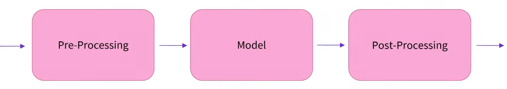

The pipeline function returns an end-to-end object that performs an NLP task on one or several texts. 

The pipeline function is the most high-level API of the Transformers library. It regroups together all the steps to go from raw texts to usable predictions. The model used is at the core of a pipeline, but the pipeline also include all the necessary pre-processing (since the model does not expect texts, but numbers) as well as some post-processing to make the output of the model human-readable.



The examples will be shown in this document are:
- Text Classification
- Zero-Shot Classification
- Text Generation
- Text Completion
- Question Answering
- Summarization
- Translation

This is an example for sentiment-analysis example:

```python
from transformers import pipeline

classifier = pipeline("sentiment-analysis")
classifier("I've been waiting for a HuggingFace course my whole life.")
```

```python
[{'label': 'POSITIVE', 'score': 0.9598047137260437}]
```

This pipeline performs text classification on a given input, and determines if it's positive or negative. Here, it attributed the positive label on the given text, with a confidence of 95%.

You can pass multiple sentences as arguments, the pipeline will return a list of results:

```python
classifier([
    "I've been waiting for a HuggingFace course my whole life.", 
    "I hate this so much!"
])
```

```python
[{'label': 'POSITIVE', 'score': 0.9598047137260437},
 {'label': 'NEGATIVE', 'score': 0.9997296924591064}]
```

The zero-shot classification pipeline is a more general text-classification pipeline. It allows you to provide the labels you want. Here we want to classify our input text among the labels "education", "politics" and "business":

```python
from transformers import pipeline

classifier = pipeline("zero-shot-classification")
classifier(
    "This is a course about the Transformers library",
    candidate_labels=["education", "politics", "business"],
)
```

```python
{'sequence': 'This is a course about the Transformers library',
 'labels': ['education', 'business', 'politics'],
 'scores': [0.8445963859558105, 0.1119766908288002, 0.043426975816726685]}
```
The pipeline successfully recognizes it's more about education than the other labels, with a confidence of 84%. 

Moving on to other tasks, the text generation pipeline will auto-complete a given prompt. The output is generated with a bit of randomness, so it changes each time you call the generator object on a given prompt.

```python
from transformers import pipeline

generator = pipeline("text-generation")
generator("In this course, we will teach you how to")
```

```python
[{'generated_text': "In this course, we will teach you how to use the tools and techniques of the trade to create a successful business. We will also teach you how to use the tools and techniques of the trade to create a successful business."}]
```

Up until now, we have used the pipeline API with the default model associated to each task, but you can use it with any model that has been pre-trained or fine-tuned on this task. Going on the [model hub](https://huggingface.co/models), you can filter the available models by task. The default model used in our previous example was gpt2, but there are more models available, and not just an English!

Let's load another model, distilgpt2, and use it with the text-generation pipeline:

```python
from transformers import pipeline

generator = pipeline("text-generation", model="distilgpt2")
generator("In this course, we will teach you how to", max_length=30, num_return_sequences=2)
```

```python
[{'generated_text': 'In this course, we will teach you how to use the tools and techniques of the trade to create a successful business. We will also teach you how to use the tools and techniques of the trade to create a successful business.'},
 {'generated_text': 'In this course, we will teach you how to use the tools and techniques of the trade to create a successful business. We will also teach you how to use the tools and techniques of the trade to create a successful business.'}]
```

We can specify several arguments, such as the maximum length of the output text or the number of sentences we want to return (since there is a randomness in the generation). 

```python
from transformers import pipeline

unmasker = pipeline("fill-mask")
unmasker("This course will teach you all about <mask> models.", top_k=2)
```

```python
[{'sequence': 'This course will teach you all about mathematical models.',
  'score': 0.19610512256622314,
  'token': 30402,
  'token_str': ' mathematical'},
 {'sequence': 'This course will teach you all about computational models.',
  'score': 0.040075920164346695,
  'token': 38163,
  'token_str': ' computational'}]
```

Generating text by guessing the next word in a sentence was the pre-training objective of GPT-2, the fill mask pipeline is the pre-training objective of BERT, which is to guess the value of masked word. In this case, we ask the two most likely values for the missing words (according to the model) and get mathematical or computational as possible answers.

Another task Transformers model can perform is to classify each word in the sentence instead of the sentence as a whole. One example of this is Named Entity Recognition, which is the task of identifying entities, such as persons, organizations or locations in a sentence.

```python
from transformers import pipeline
ner = pipeline("ner", grouped_entities=True)
ner("My name is Sylvain and I work at Hugging Face in Brooklyn.")
```

```python
[{'entity_group': 'PER',
  'score': 0.9989,
  'word': 'Sylvain',
  'start': 11,
  'end': 18},
 {'entity_group': 'ORG',
  'score': 0.9793,
  'word': 'Hugging Face',
  'start': 33,
  'end': 45},
 {'entity_group': 'LOC',
  'score': 0.9985,
  'word': 'Brooklyn',
  'start': 49,
  'end': 57}]
```

Here, the model correctly finds the person (Sylvain), the organization (Hugging Face) as well as the location (Brooklyn) inside the input text. The grouped_entities=True argument used is to make the pipeline group together the different words linked to the same entity (such as Hugging and Face here).

Another task available with the pipeline API is extractive question answering. Providing a context and a question, the model will identify the span of text in the context containing the answer to the question. 

```python
from transformers import pipeline

question_answerer = pipeline("question-answering")
question_answerer(
    question="Where do I work?",
    context="My name is Sylvain and I work at Hugging Face in Brooklyn"
)
```

```python
{'score': 0.6225258703231812, 'start': 33, 'end': 45, 'answer': 'Hugging Face'}
```

Getting short summaries of very long articles is also something the Transformers library can help with, with the summarization pipeline.

```python
from transformers import pipeline

summarizer = pipeline("summarization")
summarizer("""
    America has changed dramatically during recent years. Not only has the number of 
    graduates in traditional engineering disciplines such as mechanical, civil, 
    electrical, chemical, and aeronautical engineering declined, but in most of 
    the premier American universities engineering curricula now concentrate on 
    and encourage largely the study of engineering science. As a result, there 
    are declining offerings in engineering subjects dealing with infrastructure, 
    the environment, and related issues, and greater concentration on high 
    technology subjects, largely supporting increasingly complex scientific 
    developments. While the latter is important, it should not be at the expense 
    of more traditional engineering.

    Rapidly developing economies such as China and India, as well as other 
    industrial countries in Europe and Asia, continue to encourage and advance 
    the teaching of engineering. Both China and India, respectively, graduate 
    six and eight times as many traditional engineers as does the United States. 
    Other industrial countries at minimum maintain their output, while America 
    suffers an increasingly serious decline in the number of engineering graduates 
    and a lack of well-educated engineers.
""")
```

```python
[{'summary_text': ' America has changed dramatically during recent years . The number of graduates in traditional engineering disciplines has declined . In most of the premier American universities engineering curricula now concentrate on engineering science . There are declining offerings in engineering subjects dealing with infrastructure , the environment , and related issues .'}]
```

Finally, the last task supported by the pipeline API is translation. Here we use a French/English model found on the model hub to get the English version of our input text.

```python
from transformers import pipeline

translator = pipeline("translation", model="Helsinki-NLP/opus-mt-fr-en")
translator("Ce cours est produit par Hugging Face.")
```

```python
[{'translation_text': 'This course is produced by Hugging Face.'}]
```

<iframe width="560" height="315" src="https://www.youtube.com/embed/tiZFewofSLM?si=5tZ3n_TeVB76wRfB" title="YouTube video player" frameborder="0" allow="accelerometer; autoplay; clipboard-write; encrypted-media; gyroscope; picture-in-picture; web-share" allowfullscreen></iframe>

Source: [Pipelines for inference](https://huggingface.co/docs/transformers/pipeline_tutorial#pipelines-for-inference)