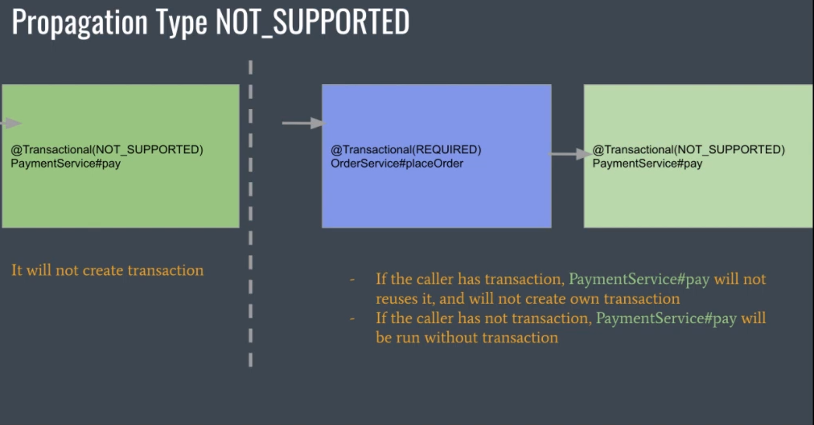

# Spring Transactions Like A Hero

> Bu Notlar Hüseyin Babal'ın [Spring Transactions Like A Hero](https://youtu.be/uTG952A6KBY) videosundan alınmıştır.

Spring, eğer bir methodun üzerine `@Transactional` annotation'ı koyarsak, o method için bir proxy oluşturur.

> Spring, Byte manipulation ve Reflection’u kullanarak yapıyor.

> Spring, private mehtod'larda transactional annotation'ı desteklemiyor. Örnek olarak yukarıda tanımlanmış olan `create` method'unu ele alırsak,
> `create` method'u `@Transactional` annotation'ı ile işaretlenmiş olsa bile, `create` method'u eğer aynı class içerisinde başka bir methodu çağırıyorsa
> ve çağırılan method `@Transactional` annotation'ı ile işaretlenmiş olsa bile, çağırılan method transactional olarak çalışmayacaktır. Bunun sebebi
> Spring'in private method'larda transactional annotation'ı desteklememesidir.

Transaction Propagation, herhangi bir component'in veya servisin işleme katılıp katılmayacağını belirtir. Ayrıca, arayan component'in veya servisin halihazırda oluşturulmuş bir işlemi olup olmadığı durumunda nasıl davranacağını da gösterir.

Propagation Tipleri:

Transaction'daki Isolation Seviyeleri:

- Dirty Read
- Non-Repeatable Read
- Phantom Read

|          Dirty Read           |               Non-Repeatable Read               |           Phantom Read            |
| :---------------------------: | :---------------------------------------------: | :-------------------------------: |
|  |  |  |

Spring Isolation Seviyeleri:

- ISOLATION_READ_UNCOMMITTED
- ISOLATION_READ_COMMITTED
- ISOLATION_REPEATABLE_READ
- ISOLATION_SERIALIZABLE

Video içerisindeki kod örneklerine [buradan](https://youtu.be/uTG952A6KBY?t=2727) ulaşabilirsiniz. Çok uzun olduğu için buraya eklemek istemedim.
